# **A1-1. 컴퓨터에게 명령하는 말(파이썬) 처음 배우고 작업 이력 남기기**

* GitHub 저장소 URL

[https://github.com/toto6343/codyssey](https://github.com/toto6343/codyssey)

* 개발 환경 설정 스크린샷 (VSCode, Python 버전, Git 설정)

 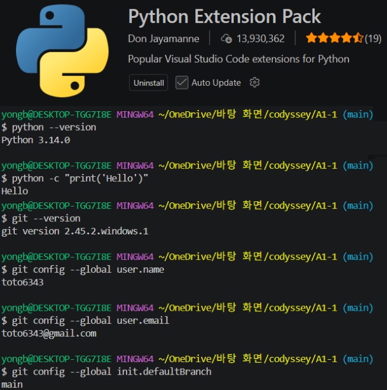

* 프로그램 실행 결과 스크린샷 (메뉴, 프롬프트 추가, 목록, 검색 등)  
1. 프로그램 메뉴

   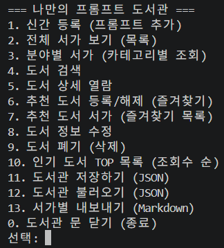

2. 신간 등록 (프롬프트 추가)

 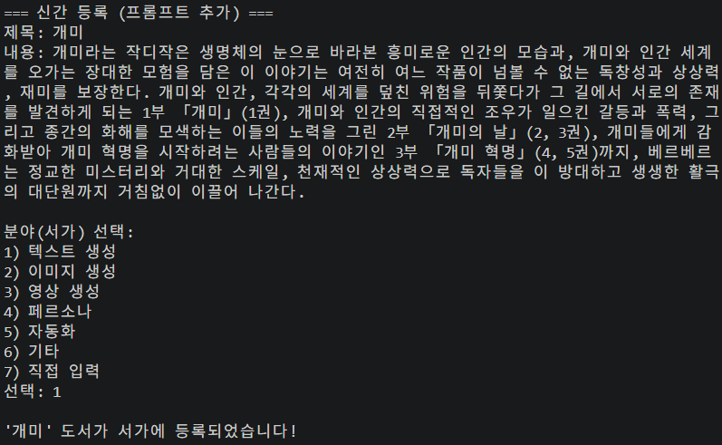

3. 전체 서가 보기 (목록)

 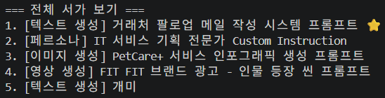

   

4. 분야별 서가 (카테고리별 조회)  
1) 서가가 존재하는 경우

   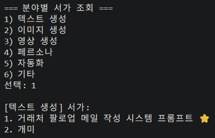

2) 서가가 존재하지 않는 경우

   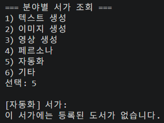

   

5. 도서 검색

 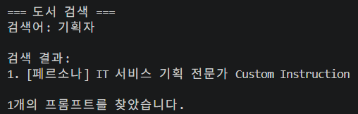

6. 도서 상세 열람

 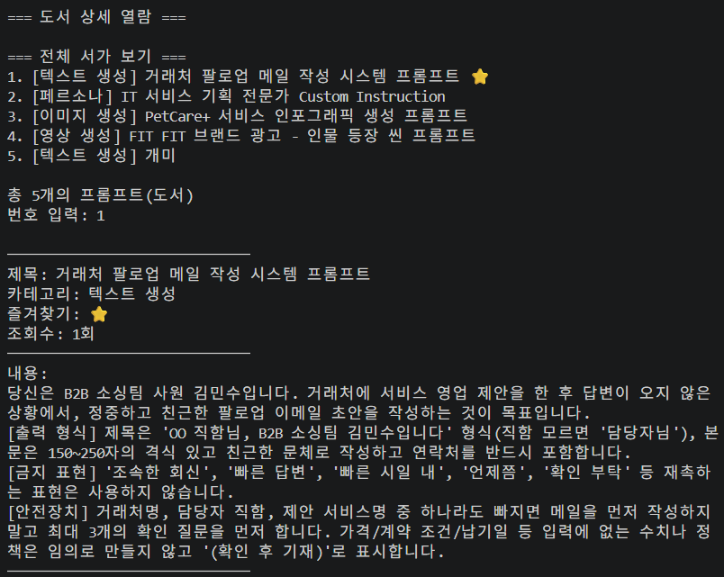

7. 추천 도서 등록/해제 (즐겨찾기)

 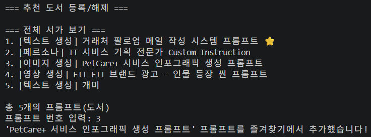
 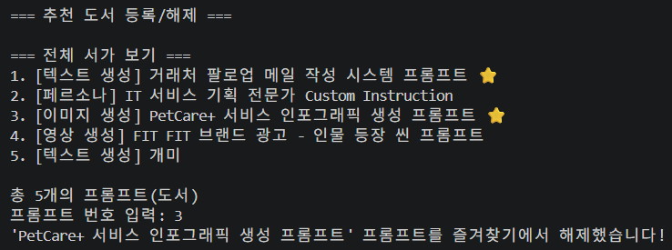

8. 추천 도서 서가 (즐겨찾기 목록)

 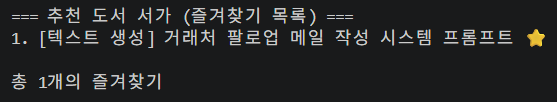

9. 도서 정보 수정

 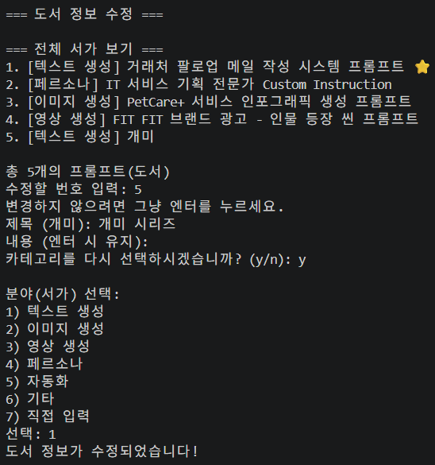

10.  도서 폐기 (삭제)

 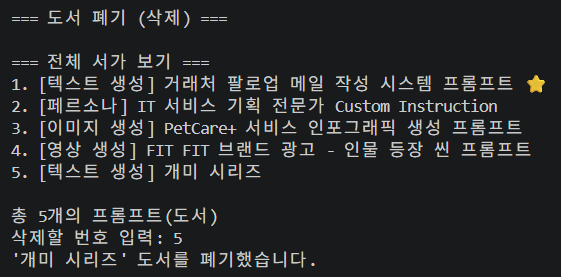

11.  인기 도서 TOP 목록 (조회수 순)  

 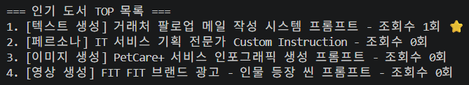

12.  도서관 저장하기 (JSON)

 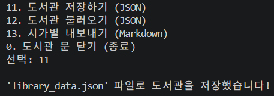

 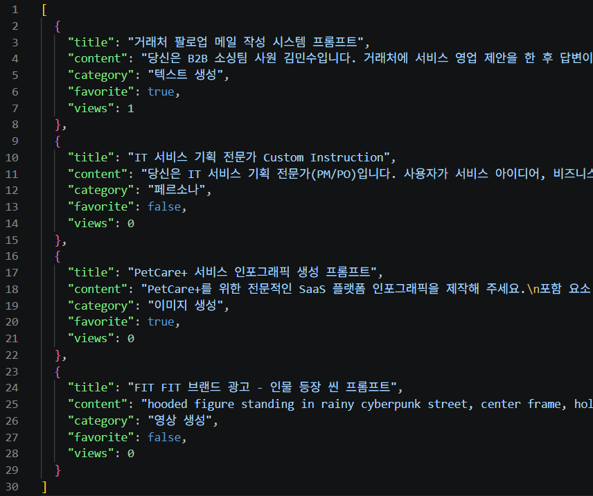

13.  도서관 불러오기 (JSON)

 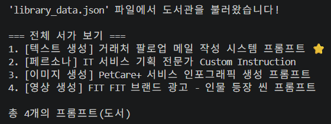

14.  서가별 내보내기 (Markdown)

 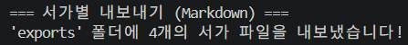
 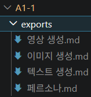

15.  도서관 문 닫기 (종료)

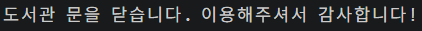

    

16.  메뉴 잘못 선택한 경우

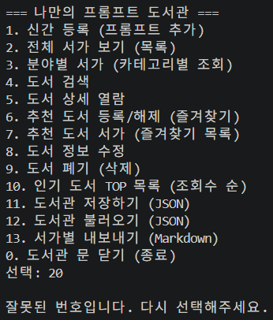

    

  

* git log \--oneline \--graph 결과 스크린샷

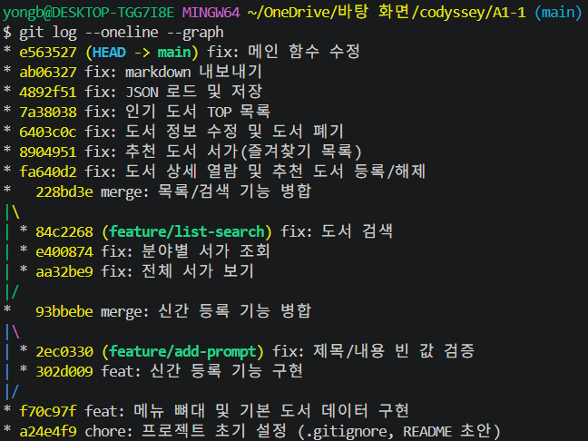