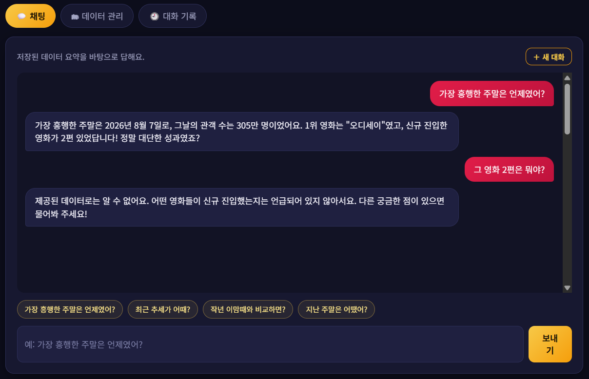

# 🎟️ 주말극장 — 박스오피스 AI 비서
🔗 **[서비스 바로가기](https://weekend-cinema-six.vercel.app)** · [Swagger UI](https://boxofficekr.onrender.com/docs)

KOBIS 주말 박스오피스 데이터를 분석해 요약하고, 그 요약을 GPT에게 주입해 **내 데이터를 아는 AI 비서**로 대화하는 웹 서비스입니다.
일반 ChatGPT는 "지난 주말 박스오피스가 어땠어?"에 답하지 못하지만, 주말극장은 저장된 데이터의 기간·평균·최고/최저·트렌드·전년 동기 대비를 근거로 답합니다.

## 배포 URL

## 배포 URL

| 구분 | URL |
|---|---|
| 프론트엔드 (Vercel) | https://weekend-cinema-six.vercel.app |
| 백엔드 API (Render) | https://boxofficekr.onrender.com |
| Swagger UI | https://boxofficekr.onrender.com/docs |
| 헬스체크 | https://boxofficekr.onrender.com/health |

> 백엔드는 Render 무료 티어라 오랜 시간 접속이 없으면 잠들고, **첫 요청은 최대 1분** 걸릴 수 있습니다. 화면에 안내 문구가 표시됩니다.

## 기술 스택

| 영역 | 사용 기술 |
|---|---|
| 백엔드 | Python, FastAPI, Pydantic |
| DB | Firebase Firestore (`data`, `conversations` 컬렉션) |
| AI | OpenAI GPT API (컨텍스트 주입 + Function Calling) |
| 데이터 | KOBIS 주말 박스오피스 (금~일 상위 10편 관객수 합계) |
| 프론트엔드 | HTML / CSS / JavaScript (프레임워크 없음), Chart.js |
| 외부 채널 | MCP Server (Python `mcp`) |
| 배포 | Render (백엔드), Vercel (프론트엔드) |

## 주요 기능

- **데이터 기반 AI 채팅**: 데이터 요약을 시스템 프롬프트에 주입, 로딩 표시, 대화 자동 저장
- **데이터 관리(CRUD)**: 날짜·관객수·메모 추가/수정/삭제, KOBIS 최신 데이터 동기화
- **대화 기록**: 대화 목록 조회, 이전 대화 불러오기, 삭제
- **데이터 요약**: 기간, 개수, 평균/최고/최저, 최근 4주 트렌드, 전년 동기 대비, TOP 5
- **보너스**: Function Calling, MCP 연동, 추가 통계와 그래프, CSV/JSON 내보내기, 다크/라이트 모드

## 프로젝트 구조

```
backend/
  app/
    main.py            # FastAPI 앱, CORS, 예외 핸들러
    config.py          # 환경변수 설정
    firebase.py        # Firestore 클라이언트
    schemas.py         # Pydantic 요청/응답 모델
    routers/           # data, conversations, chat
    services/          # data, conversation, chat, tools, summary, kobis
  mcp_server.py        # MCP Server (외부 채널)
  requirements.txt
frontend/
  public/              # index.html, style.css, app.js
  build.js             # 배포 시 config.js 생성
scripts/               # 데이터 수집 스크립트
```

**라우터/서비스 분리 기준**: 라우터는 HTTP 요청·응답 형식만 다루고, 비즈니스 로직과 Firestore 접근은 서비스가 담당합니다. 그래서 채팅 서비스가 HTTP 재호출 없이 데이터 서비스 함수를 직접 사용할 수 있습니다.

## API 요약

| 메서드 | 경로 | 설명 |
|---|---|---|
| POST | `/api/data` | 데이터 추가 |
| GET | `/api/data` | 목록 조회 |
| PUT | `/api/data/{id}` | 수정 |
| DELETE | `/api/data/{id}` | 삭제 |
| GET | `/api/data/summary` | 요약 (프롬프트 주입용) |
| GET | `/api/data/statistics` | 추가 통계 (보너스) |
| GET | `/api/data/export?format=csv\|json` | 내보내기 (보너스) |
| POST | `/api/data/sync` | KOBIS 최신 데이터 동기화 |
| POST | `/api/conversations` | 대화 저장 |
| GET | `/api/conversations` | 대화 목록 (messages 미포함) |
| GET | `/api/conversations/{id}` | 특정 대화 전체 메시지 |
| DELETE | `/api/conversations/{id}` | 대화 삭제 |
| POST | `/api/chat` | AI 대화 (컨텍스트 주입 + 도구 호출 + 자동 저장) |

## 컨텍스트 주입 원리

1. `GET /api/data/summary`와 같은 요약을 서비스 함수로 계산합니다.
2. 요약(기간, 개수, 지표, 트렌드 등)을 시스템 프롬프트 템플릿에 채워 넣습니다.
3. 시스템 프롬프트 + 최근 대화 + 사용자 질문을 GPT에 전달합니다.
4. 답변을 `conversations`에 자동 저장합니다.

데이터가 프롬프트에 들어 있으므로 GPT는 요약 범위 밖의 내용은 추측하지 않고 "제공된 데이터로는 알 수 없어요"라고 답하도록 규칙을 두었습니다.

## 로컬 실행

```bash
# 백엔드
cd backend
python -m venv venv
venv\Scripts\activate          # macOS/Linux: source venv/bin/activate
pip install -r requirements.txt
cp .env.example .env           # 값 채우기
uvicorn app.main:app --reload  # http://localhost:8000/docs

# 프론트엔드: frontend/public 을 Live Server 등으로 열기 (기본 포트 5500)
```

## 환경 변수

**백엔드 (Render)**

| 이름 | 설명 |
|---|---|
| `OPENAI_API_KEY` | OpenAI API 키 |
| `KOBIS_API_KEY` | KOBIS 오픈API 키 |
| `FIREBASE_SERVICE_ACCOUNT_JSON` | 서비스 계정 키(JSON 문자열 또는 파일 경로) |
| `ALLOWED_ORIGINS` | CORS 허용 도메인, 콤마로 구분 |
| `OPENAI_MODEL` (선택) | 기본 `gpt-4o-mini` |
| `CHAT_MAX_TOKENS` (선택) | 기본 500 |

**프론트엔드 (Vercel)**

| 이름 | 설명 |
|---|---|
| `API_BASE_URL` | 백엔드 주소 (빌드 시 `config.js`로 주입) |

> API 키는 서버에만 두고 코드·프론트에 노출하지 않습니다. 프론트에는 공개되어도 되는 백엔드 주소만 넣습니다.

---

## 보너스 1. AI 도구 호출 (Function Calling) + MCP 연동

### 정의한 도구

| 도구 | 언제 호출되는가 |
|---|---|
| `get_data_summary` | 기간·평균·최고/최저·트렌드를 최신 상태로 확인해야 할 때 |
| `get_statistics` | 월별 통계, 표준편차, 직전 주 대비, 이동평균 질문일 때 |
| `list_conversations` | 이전 대화가 있었는지 물어볼 때 |
| `get_conversation` | 특정 이전 대화의 내용을 물어볼 때 |

모든 도구에는 `reason` 파라미터가 필수입니다. 모델이 **호출 이유를 직접 적게 해서** 근거를 남기고, 응답의 `tool_calls`에 담겨 채팅 화면에 🔧로 표시됩니다.

### 호출 흐름

```
사용자 질문
  → /api/chat: 요약을 시스템 프롬프트에 주입 후 GPT 호출
  → GPT가 요약만으로 부족하다고 판단하면 tool_call 결정 (reason 포함)
  → 서버가 도구 실행 (Firestore 조회, 서비스 함수 직접 호출)
  → 결과를 tool 메시지로 GPT에 전달 (최대 3회 반복)
  → 최종 답변 + tool_calls 반환, 대화 자동 저장
```

### 호출 근거 예시

⚠️ 아래 표를 **실제로 테스트한 결과**로 채우세요 (질문, 호출된 도구, reason 캡처).

| 질문 | 호출된 도구 | 근거(reason) |
|---|---|---|
| "월별로 평균 관객이 어떻게 달라?" | `get_statistics` | ⚠️ 화면에 표시된 reason |
| "지난주보다 얼마나 늘었어?" | ⚠️ | ⚠️ |
| "예전에 무슨 얘기 했었지?" | ⚠️ | ⚠️ |
| "최근 트렌드가 뭐야?" | 호출 없음 | 프롬프트 요약에 이미 있어 도구 불필요 |

> 마지막 행처럼 **필요할 때만 호출된다**는 점을 함께 보여주는 것이 좋습니다.

### MCP Server 연동 (외부 채널)

`backend/mcp_server.py`가 배포된 REST API를 MCP 도구(`get_data_summary`, `get_statistics`, `list_conversations`, `get_conversation`)로 노출합니다. 내부 로직을 중복 구현하지 않고 같은 API를 재사용합니다.

```
Claude Desktop (MCP 클라이언트) → mcp_server.py (stdio) → Render API → Firestore
```

- 검증 방법: Claude Desktop 설정(`claude_desktop_config.json`)에 등록하고 "박스오피스 월별 통계 알려줘" 요청
- ⚠️ 호출 캡처: `docs/mcp-call.png` (아직 캡처 전이라면 반드시 찍어서 추가)

## 보너스 2. 인사이트·UX 고도화

- **추가 지표**: `/api/data/statistics`에서 중앙값, 표준편차, 직전 주 대비 증감률, 월별 통계, 4주 이동평균 제공
- **시각화**: Chart.js 라인 그래프(주말 관객수 + 4주 이동평균)
- **내보내기**: 데이터 관리 탭에서 CSV/JSON 다운로드 (CSV는 엑셀에서 한글이 깨지지 않도록 UTF-8 BOM 포함)
- **다크/라이트 모드**: 헤더 토글, 선택값은 브라우저에 저장, 그래프 색상도 함께 전환

## 제출 스크린샷

⚠️ 파일을 `docs/` 폴더에 넣고 경로를 맞추세요.

| 화면 | 파일 |
|---|---|
| 데이터 요약이 보이는 채팅 (질문+답변) | `docs/chat.png` |
| 데이터 관리 (CRUD 동작) | `docs/data.png` |
| 대화 기록 (불러오기 동작) | `docs/history.png` |
| 그래프 + 추가 지표 | `docs/chart.png` |
| 다크 / 라이트 모드 | `docs/theme.png` |
| 도구 호출 표시(🔧)가 있는 답변 | `docs/tool-call.png` |
| MCP 호출 | `docs/mcp-call.png` |

```markdown

```